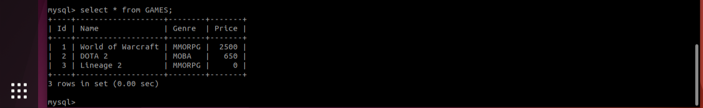
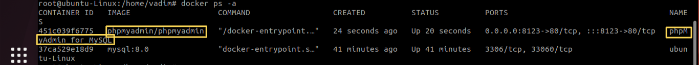
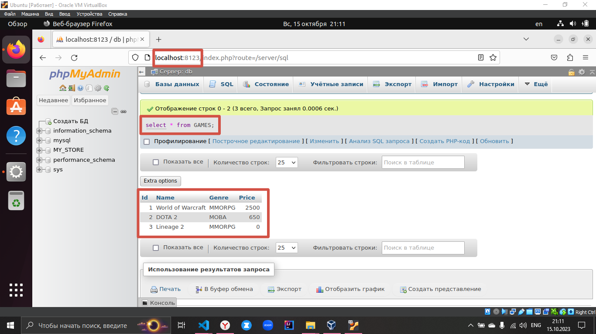

## Тимофеев Вадим, группа № 4334/4336/4338
Семинар № 3 по Контейнеризации (`Docker`)

`Задание`:
1) запустить контейнер с БД, отличной от mariaDB:
2) добавить в контейнер hostname такой же, как hostname системы через переменную
3) заполнить БД данными через консоль
4) запустить phpmyadmin (в контейнере) и через веб проверить, что все введенные данные доступны

> Запускаю контейнер с MySQL версии 8.0 с именем = имени хоста

mkdir mysql_databases //папка для монтирования  
sudo docker run --name $HOSTNAME -e MYSQL_ROOT_PASSWORD=lokation -v /home/vadim/mysql_databases:/var/lib/mysql -d mysql:8.0  
* --name - задаем имя хоста
* -e переменная среды с заданием пароля для рута
* -v монтирование внешней папки из хостовой системы для сохранения баз данных в хостовой файловой системе в случае удаления контейнера
* mysql:8.0 - образ контейнера и его версия

> проверяем создание контейнера:  

docker ps -a 

  

> Заходим в MySQL БД

docker exec -it ubuntu-Linux bash  
mysql -u root -p   

> Заполняем БД через консоль с помощью простых SQL-запросов 

create database MY_STORE;  
use MY_STORE;  
create table GAMES (Id INT PRIMARY KEY AUTO_INCREMENT, Name VARCHAR(100) NOT NULL, Genre VARCHAR(45), Price DOUBLE NOT NULL);  
INSERT INTO GAMES (Name, Genre, Price) VALUES ('World of Warcraft', 'MMORPG','2500.0'), ('DOTA 2', 'MOBA','650.0'), ('Lineage 2', 'MMORPG','0.0');  

> Смотрим что получилось:

SHOW * FROM GAMES;

 

> Запускаем новый phpMyAdmin контейнер для отображения БД в браузере:

sudo docker run -d --name phpMyAdmin_for_MySQL --link ubuntu-Linux:db -p 8123:80 phpmyadmin/phpmyadmin
* --link ubuntu-Linux:db - связывает контейнер с именем ubuntu-Linux, кот. является MySQL, как :db - база данных
* -p ... проброс портов. 1 - в хостовой, 2 - внутри контейнера
* phpmyadmin/phpmyadmin - образ

> Проверяем, что он создался: 

docker ps -a

 

> Теперь просто заходим в браузер и вводим в адресную строку: localhost:8123, где 8123 - порт в хостовой системе для проброса, который мы указывали при создании контейнера phpMyAdmin

 